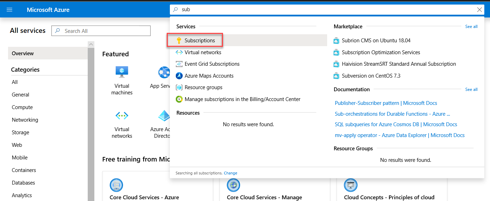
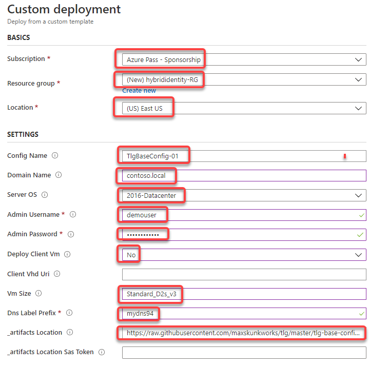
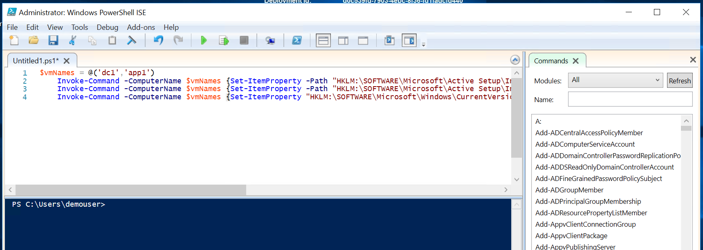
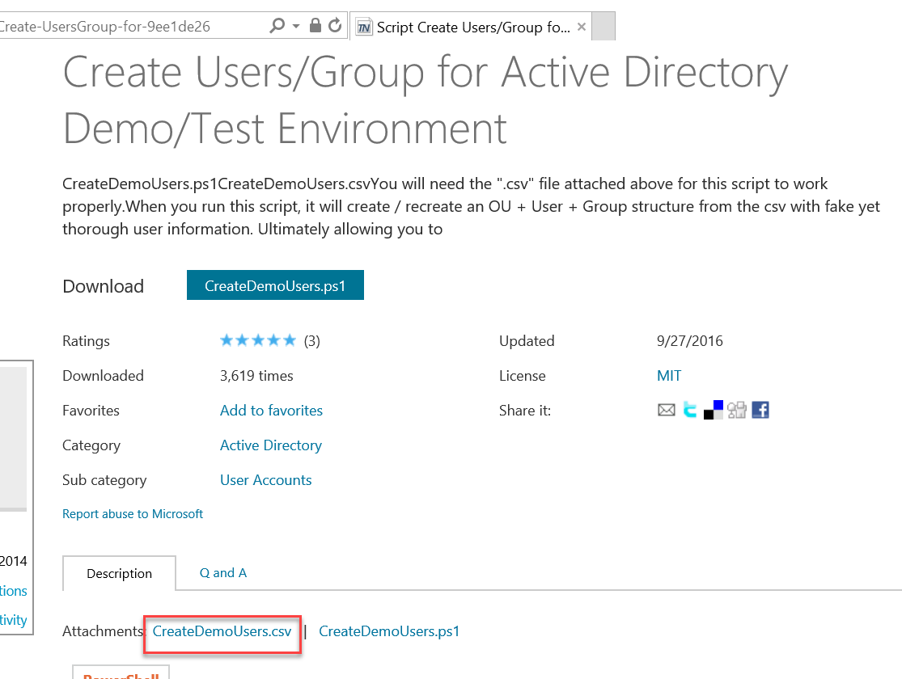

# Azure Fundementals: Identity Setup Guide

**Contents**

<!-- TOC -->

- [Azure Fundementals: Identity Setup Guide](#azure-fundementals-identity-setup-guide)
- [Hybrid identity before the hands-on lab setup guide](#hybrid-identity-before-the-hands-on-lab-setup-guide)
  - [Requirements](#requirements)
  - [Before the hands-on lab](#before-the-hands-on-lab)
    - [Task 1: Review the relevant Microsoft documentation](#task-1-review-the-relevant-microsoft-documentation)
    - [Task 2: Validate the role in the Azure subscription](#task-2-validate-the-role-in-the-azure-subscription)
    - [Task 3: Deploy the lab environment Azure VMs](#task-3-deploy-the-lab-environment-azure-vms)
    - [Task 4: Configure the lab environment Azure VMs](#task-4-configure-the-lab-environment-azure-vms)
    - [Task 5: Restart the Azure VMs](#task-5-restart-the-azure-vms)
    - [Task 6: Configure contoso.local Active Directory](#task-6-configure-contosolocal-active-directory)

<!-- /TOC -->

# Hybrid identity before the hands-on lab setup guide

## Requirements

-   A Microsoft Azure subscription with at least 16 vCPU available in the Azure region where the Azure VMs deployed in this lab will reside.

    -   DC1 and APP1 VMs -- 2 x D8s\_v3: 2 x 8 vCPUs = 16 vCPUs

-   A Microsoft account with the owner or the contributor role in the Azure subscription

   > **Note**: The lab computer does not require locally installed software. 

## Before the hands-on lab

Timeframe: 150 minutes


### Task 1: Review the relevant Microsoft documentation 

1. Review online documentation regarding Azure Active Directory at <https://docs.microsoft.com/en-us/azure/active-directory/> focusing in particular on its integration with Active Directory and its B2B capabilities.


### Task 2: Validate the role in the Azure subscription

1. Login to the Azure portal at <http://portal.azure.com>, select  **All services**. Then search for and select **Subscriptions**.

     

2. On the **Subscriptions** blade, select the name of the subscription you intend to use for this lab.

3. On the subscription blade, select **Access control (IAM)**.

4. Review the list of user accounts, and verify that your user account has the Owner or Contributor role assigned to it.


### Task 3: Deploy the lab environment Azure VMs

1. In the browser window displaying the Azure portal, navigate to: <https://github.com/maxskunkworks/TLG/tree/master/tlg-base-config_3-vm>.

2. On the **TLG (Test Lab Guide) - 3 VM Base Configuration (v1.0)** page, select **Deploy to Azure**.

   > **Note**: The 3 VM Base Configuration provisions a Windows Server 2016 Active Directory domain controller named DC1 using the domain name you specify and a domain member server named APP1 running Windows Server 2016. It also offers an option to provision a client VM running Windows 10, however we will not be using it in our lab (primarily due to licensing requirements applicable when running Windows 10 VMs in Azure). The domain member server (APP1) has automatically installed .NET 4.5 and IIS.

3. On the **Custom deployment** blade, specify the following settings, then select **Review + Create** then **Create**.

    -   Subscription: the name of the target Azure subscription where you want to provision the lab environment Azure VMs.

    -   Resource group: (Create new) **hybrididentity-RG**

    -   Location: the name of the Azure region that will host the lab environment Azure VMs.

    -   Config Name: **TlgBaseConfig-01**

    -   Domain Name: **contoso.local**

    -   Server OS: **2016-Datacenter**

    -   Admin Username: **demouser**

    -   Admin Password: **demo@pass123**

    -   Deploy Client VM: **No**

    -   Client VHD URI: **leave blank**

    -   VM Size: **Standard_D2s_v3**
   
    **Note**: Use a similar VM size if your subscription does not support the listed size. Documentation is linked here. <https://docs.microsoft.com/en-us/azure/virtual-machines/windows/sizes>

    -   DNS Label Prefix: **any valid, globally unique DNS name (a unique string consisting of letters, digits, and hyphens, starting with a letter and up to 47 characters long).**

    -   _artifacts Location: **accept the default**

    -   _artifacts Location Sas Token: **leave blank**

    


4. Wait for the deployment to complete. This might take about 60 minutes.


### Task 4: Configure the lab environment Azure VMs

1. In the browser window displaying the Azure portal, navigate to the **DC1** Azure VM and connect to it via Remote Desktop. When prompted, sign in by using the following credentials:

    -   Username: **demouser**

    -   Password: **demo\@pass123**

2.  Within the Remote Desktop session to **DC1**, start **Windows PowerShell ISE**, add the following script to the script pane, and run it to disable Internet Explorer enhanced security configuration and User Access Control on both **DC1** and **APP1** Azure VMs:

    ```pwsh

    $vmNames = @('dc1','app1')
    Invoke-Command -ComputerName $vmNames {Set-ItemProperty -Path "HKLM:\SOFTWARE\Microsoft\Active Setup\Installed Components\{A509B1A7-37EF-4b3f-8CFC-4F3A74704073}" -Name "IsInstalled" -Value 0}
    Invoke-Command -ComputerName $vmNames {Set-ItemProperty -Path "HKLM:\SOFTWARE\Microsoft\Active Setup\Installed Components\{A509B1A8-37EF-4b3f-8CFC-4F3A74704073}" -Name "IsInstalled" -Value 0}
    Invoke-Command -ComputerName $vmNames {Set-ItemProperty "HKLM:\SOFTWARE\Microsoft\Windows\CurrentVersion\Policies\System" -Name "ConsentPromptBehaviorAdmin" -Value 00000000}
    ```

    **Note:** To run multiple PowerShell scripts in the same file, you can highlight a specific script and select **Run Selection** next to the green play button. 

    

3.  Within the **Windows PowerShell ISE** window  add the following script to the script pane, and run it to install Remote Server Administration Tools on both **DC1* and **APP1** Azure VMs:

    ```pwsh

    $vmNames = @('dc1','app1')
    Invoke-Command -ComputerName $vmNames {Install-WindowsFeature RSAT -IncludeAllSubFeature} 
    ```

4.  Within the **Windows PowerShell ISE** window  add the following script to the script pane, and run it to enable TLS 1.2 on both **DC1* and **APP1** Azure VMs:

    ```pwsh

    $vmNames = @('dc1','app1')
    Invoke-Command -ComputerName $vmNames {New-Item 'HKLM:\SYSTEM\CurrentControlSet\Control\SecurityProviders\SCHANNEL\Protocols\TLS 1.2\Server' -Force}
    Invoke-Command -ComputerName $vmNames {New-Item 'HKLM:\SYSTEM\CurrentControlSet\Control\SecurityProviders\SCHANNEL\Protocols\TLS 1.2\Client' -Force}
    Invoke-Command -ComputerName $vmNames {New-ItemProperty -path 'HKLM:\SYSTEM\CurrentControlSet\Control\SecurityProviders\SCHANNEL\Protocols\TLS 1.2\Client' -name 'Enabled' -value 1 –PropertyType DWORD}
    Invoke-Command -ComputerName $vmNames {New-ItemProperty -path 'HKLM:\SYSTEM\CurrentControlSet\Control\SecurityProviders\SCHANNEL\Protocols\TLS 1.2\Client' -name 'DisabledByDefault' -value 0 –PropertyType DWORD}
    Invoke-Command -ComputerName $vmNames {New-ItemProperty -Path 'HKLM:\SOFTWARE\Microsoft\.NETFramework\v4.0.30319' -name 'SchUseStrongCrypto' -value 1 –PropertyType DWORD}
    ```

5.  Within the **Windows PowerShell ISE** window  add the following script to the script pane, and run it to configure Windows Integrated Authentication on the Default Web Site hosted on the **APP1** Azure VM:

    ```pwsh

    $vmNames = @('app1')
    Invoke-Command -ComputerName $vmNames {Enable-WindowsOptionalFeature -Online -FeatureName IIS-WindowsAuthentication}
    Invoke-Command -ComputerName $vmNames {Set-WebConfigurationProperty -Filter "/system.webServer/security/authentication/anonymousAuthentication" -Name Enabled -Value False -PSPath IIS:\ -Location "Default Web Site"}
    Invoke-Command -ComputerName $vmNames {Set-WebConfigurationProperty -Filter "/system.webServer/security/authentication/windowsAuthentication" -Name Enabled -Value True -PSPath IIS:\ -Location "Default Web Site"}
    ```

### Task 5: Restart the Azure VMs

1. Within the **Windows PowerShell ISE** window, from the console pane, run the following to restart **APP1**:

    ```pwsh

    Restart-Computer -ComputerName 'APP1'
    ```

2. Within the **Windows PowerShell ISE** window, from the console pane, run the following to restart **DC1**:

    ```pwsh
    Restart-Computer -ComputerName 'DC1'
    ```

### Task 6: Configure contoso.local Active Directory

1. Connect again to the **DC1** Azure VM via Remote Desktop. When prompted, sign in by using the following credentials:

    -   Username: **demouser**

    -   Password: **demo\@pass123**

2.  Within the Remote Desktop session to **DC1**, start Internet Explorer and navigate to the below link.

    ```
    https://github.com/microsoft/MCW-Hybrid-identity/tree/master/Hands-on%20lab/studentfiles
    ```

3. On the **Create Users/Group for Active Directory Demo/Test Environment** page, select the **CreateDemoUsers.ps1** link, accept the licensing terms, and save the corresponding script to the local file system.

4. On the **Create Users/Group for Active Directory Demo/Test Environment** page, select the **CreateDemoUsers.csv** link (directly above the PowerShell code section) and save the corresponding csv file to the same location as the **CreateDemoUsers.ps1** file.

    

5. Within the Remote Desktop session to **DC1**, start File Explorer, navigate to the folder where you downloaded both files, right-click on the file **CreateDemoUsers.ps1**, select **Properties**, in the **CreateDemoUsers.ps1 Properties** dialog box, check the **Unblock** checkbox and select **OK**.

6. Within the File Explorer window, right-click on the file **CreateDemoUsers.ps1** again and select **Edit**. 

7. In the **Administrator: Windows PowerShell ISE** window, change line **148** from:

    ```pwsh
    $UserCount = 1000 #Up to 2500 can be created
    ```

   to
    ```pwsh
    $UserCount = 2500 #Up to 2500 can be created
    ```

8. In the **Windows PowerShell ISE** window, save the change and run the **CreateDemoUsers.ps1** script to create a lab environment organizational unit hierarchy and populate it with test user accounts. 

9.  Within the **Windows PowerShell ISE** window, add the following script to the script pane, and run it to modify settings of the AD user accounts you will use in this lab:

    ```pwsh

    $adUser1 = Get-ADUser -Filter {samAccountName -eq "AGAyers"}
    $adUser1groups = $adUser1 | Get-ADPrincipalGroupMembership 
    $adUser1groups | foreach { if ($_.name -ne 'Domain Users') {Remove-ADPrincipalGroupMembership -MemberOf $_.name -Identity $adUser1.DistinguishedName} }
    Add-ADPrincipalGroupMembership -MemberOf 'Engineering' -Identity $adUser1.DistinguishedName
    Move-ADObject -Identity $adUser1.DistinguishedName -TargetPath 'OU=NJ,OU=US,OU=Users,OU=Demo Accounts,DC=contoso,DC=local'

    Set-ADAccountPassword -Identity 'CN=Ayers\, Ann,OU=NJ,OU=US,OU=Users,OU=Demo Accounts,DC=contoso,DC=local' -Reset -NewPassword (ConvertTo-SecureString -AsPlainText "demo@pass123" -Force)

    $adUser2 = Get-ADUser -Filter {samAccountName -eq "TFBell"}
    $adUser2groups = $adUser2 | Get-ADPrincipalGroupMembership 
    $adUser2groups | foreach { if ($_.name -ne 'Domain Users') {Remove-ADPrincipalGroupMembership -MemberOf $_.name -Identity $adUser2.DistinguishedName} }
    Add-ADPrincipalGroupMembership -MemberOf 'Engineering' -Identity $adUser2.DistinguishedName
    Move-ADObject -Identity $adUser2.DistinguishedName -TargetPath 'OU=VT,OU=US,OU=Users,OU=Demo Accounts,DC=contoso,DC=local'

    Set-ADAccountPassword -Identity 'CN=Bell\, Teresa,OU=VT,OU=US,OU=Users,OU=Demo Accounts,DC=contoso,DC=local' -Reset -NewPassword (ConvertTo-SecureString -AsPlainText "demo@pass123" -Force)
    Get-ADGroup -Identity 'Domain Admins' | Add-ADGroupMember -Members 'CN=Ayers\, Ann,OU=NJ,OU=US,OU=Users,OU=Demo Accounts,DC=contoso,DC=local'
    Get-ADGroup -Identity 'Enterprise Admins' | Add-ADGroupMember -Members 'CN=Ayers\, Ann,OU=NJ,OU=US,OU=Users,OU=Demo Accounts,DC=contoso,DC=local'
    ```

10. Within the **Windows PowerShell ISE** window, add the following script to the script pane, and run it to create additional organizational units named **Servers** and **Clients** and move the **APP1** computer account to the first of them:

    ```pwsh

    New-ADOrganizationalUnit -Name 'Servers' -Path 'OU=Demo Accounts,DC=contoso,DC=local'
    New-ADOrganizationalUnit -Name 'Clients' -Path 'OU=Demo Accounts,DC=contoso,DC=local'

    Move-ADObject -Identity 'CN=APP1,CN=Computers,DC=contoso,DC=local' -TargetPath 'OU=Servers,OU=Demo Accounts,DC=contoso,DC=local'
    ```

11. Sign out from **DC1**.

You should follow all steps provided *before* performing the Hands-on lab.
